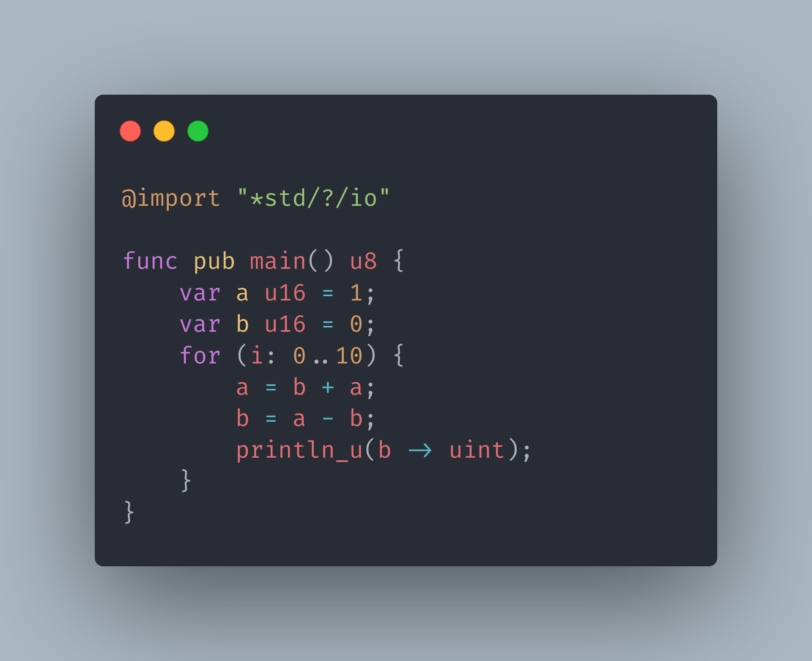

# FunnLang
## The fun toy language.

FunnLang is a low level language with a syntax like Go or Rust.

## Code renderings
All of these following images are rendered in [Carbon](https://carbon.vercel.app/).

